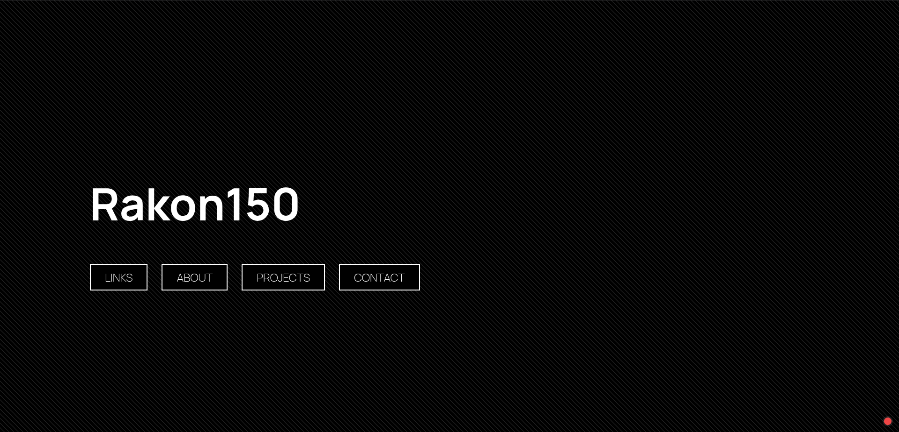
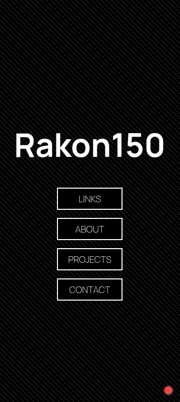

# Personal Homepage

Minimal personal portfolio featuring links, about page, project showcase, and contact options.
This took longer than expected but it definitely turned out how I wanted, some parts like the popup animations took a lot of time but in the end I managed to make a fully finished public portfolio so good enough.

---

<table border="0">
  <tr>
    <td align="center" valign="middle" width="70%">
      
       <b>Desktop view</b>
    </td>
    <td align="center" valign="middle" width="30%">
      
       <b>Mobile view</b>
    </td>
  </tr>
</table>

---

## Quick Start

Just open the [link](https://rakon.qzz.io) or the html its not that complicated

## Features
- **LINKS**
    - GitHub, Steam, itch.io, Discord
- **ABOUT**
    - location, OS, software, hardware + live Discord status via Lanyard
- **PROJECTS**
    - newest projects + full grid at `/projects/`
- **CONTACT**
    - Discord, GitHub + Lanyard presence
- **UI**
    - button to popup animation, carbon imitation background, status dot linked to uptime kuma api